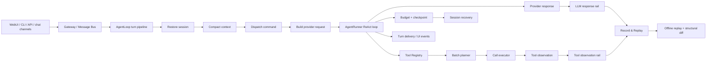

<p align="center">
  <a href="README.md">English</a> · <a href="README.zh-CN.md">简体中文</a>
</p>

<p align="center">
  <picture>
    <source media="(prefers-color-scheme: dark)" srcset="./images/readme-cover-dark.svg" />
    
  </picture>
</p>

# pawbot

### A self-hosted AI agent for your browser, terminal, and chat apps.

> **Choose your interface:** run `pawbot` for the WebUI, or run `pawbot agent`
> for the native terminal UI (TUI).

Give pawbot a task and it can read and write files, run commands, search the
web, call MCP tools, remember conversations, and run scheduled work. Use the
WebUI when you want a visual workspace, the terminal when you want speed, or a
chat app when you want your agent to be available wherever you are.

The feature that makes pawbot different is **Record & Replay**:
record one real agent turn, then replay it offline while you change the code —
without another model request, another token bill, or real tool side effects.

## Start here

| You want to... | Start with... |
|---|---|
| Install the released package | [Quick install](#quick-install) |
| Open the browser workspace | [WebUI](#webui) |
| Run one request from a terminal | [CLI](#cli) |
| Connect a chat app | [Channels](#channels-and-integrations) |
| Understand the replay feature | [Record & Replay](#record--replay) |
| Verify an AI-assisted code change | [Agent Harness Benchmark](#agent-harness-benchmark) |
| Change the agent or add a tool | [Development](#development) |

## What can pawbot do?

- Work with files, shell commands, web search, web fetching, documents, images,
  and other tools.
- Connect to MCP servers and load extensions without changing the core agent.
- Keep session history and long-term memory across conversations.
- Run long tasks and scheduled automations.
- Use Anthropic, OpenAI-compatible endpoints, local models, fallbacks, and
  model presets.
- Reach the same agent from the WebUI, CLI/TUI, API, or supported chat channels.
- Expose a Python SDK and an OpenAI-compatible API for your own applications.

## How a turn works

Every entry point reaches the same turn pipeline. The important boundary is
between the orchestration loop and the provider/tool rails: the former can be
budgeted, cancelled, checkpointed, and replayed without making the provider or
real tools part of a regression test.



The result is one execution unit with explicit resource limits, recovery
checkpoints, tool side-effect boundaries, and an offline evidence trail.

## Why pawbot?

### One agent, several ways to use it

The WebUI, terminal, API, and chat channels share the same conversations,
tools, and configuration. Start in the browser and continue from the terminal;
or keep the agent running behind a gateway and talk to it from a chat app.

### Record an agent once, replay it as often as you need

LLM calls and external tools make agent bugs expensive and difficult to repeat.
Pawbot records the model responses and tool observations of a turn. Replay then
runs the current agent code against those recorded inputs:

- no new provider request;
- no new token cost;
- no network dependency;
- no real tool side effects;
- a structural diff when orchestration changes.

This is useful for debugging, regression tests, and safe refactoring of the
agent loop.

### Keep your data on your machine

Pawbot is designed for self-hosting. Sessions, configuration, workspaces, and
recordings stay under your control. Shell commands, file access, network tools,
and MCP servers are explicit capabilities with documented security boundaries.

## Quick install

### Published package

After the package is published, install and open the WebUI with one command:

macOS / Linux:

```bash
uv tool install --force --upgrade pawbot-ai && pawbot
```

After installation, update any existing Pawbot installation without repeating
provider setup:

```bash
pawbot update
```

The update command upgrades the package through its detected installation
manager and leaves provider credentials, channel settings, sessions, and the
workspace untouched.

If a Windows installation from v0.4.1 reports `os error 32`, close Pawbot and
run `uv tool install --force --upgrade --refresh pawbot-ai` once. Starting with
v0.4.2, `pawbot update` hands the upgrade to a helper process so the running
launcher can be released before it is replaced.

Windows PowerShell:

```powershell
uv tool install --force --upgrade pawbot-ai; pawbot
```

The repository also includes isolated fallback installers. On a fresh desktop
install they start the WebUI automatically; use `pawbot agent` when you want the
terminal/TUI client explicitly:

- [`scripts/install.sh`](scripts/install.sh)
- [`scripts/install.ps1`](scripts/install.ps1)

For a fresh macOS or Linux desktop, the installer can be run directly from
GitHub:

```bash
curl -fsSL https://raw.githubusercontent.com/m2dumpling/pawbot/v0.5.0/scripts/install.sh | sh
```

If `curl` is not available, use `wget` instead:

```bash
wget -qO- https://raw.githubusercontent.com/m2dumpling/pawbot/v0.5.0/scripts/install.sh | sh
```

For native Windows PowerShell:

```powershell
iex (irm https://raw.githubusercontent.com/m2dumpling/pawbot/v0.5.0/scripts/install.ps1)
```

The installer selects an active virtual environment, `uv`, `pipx`, or a
dedicated `~/.pawbot/venv` fallback, then opens the WebUI on a fresh desktop.
Before creating the fallback environment it verifies that Python's `venv` and
`ensurepip` support is available. If a minimal Debian/Ubuntu image is missing
`python3.x-venv`, installation stops with the exact package command to run and
does not print a misleading startup command. On success it runs
`pawbot --version`; if the launcher is not on the current shell's `PATH`, it
prints the verified launcher path and the command to use now. Configure the
first Provider in **Settings → Models** before sending your first task. Quick
Start and the WebUI probe a compatible provider's `/models` endpoint after
credentials are entered, then enrich returned models with pawbot's capability
table (context window and reasoning levels). If an endpoint does not publish a
model list, the UI keeps manual model entry available.

### From a source checkout

Requirements: Python 3.11+ and [uv](https://docs.astral.sh/uv/). Released
packages download a checksum-verified native TUI for the current platform on
the first `pawbot agent` launch; Bun is only needed when developing from a
source checkout.

```bash
uv sync --all-extras --dev
uv run pawbot --help
```

Install optional channel dependencies when needed:

```bash
uv run --no-sync python -m scripts.install_channel_dependencies --all-channels
```

## Quick start

### WebUI

The browser workspace is the easiest first run:

```bash
uv run pawbot webui
```

Configure your first provider in **Settings → Models**; the model picker loads
available models after credentials are saved. Start a new conversation and send
`Hello!`. The first-run WebUI binds to localhost by default.

On a Linux server, localhost is intentionally private to the server. Bind the
WebUI explicitly when you need to open it from another machine:

```bash
pawbot webui --remote --yes --no-open
```

Then open `http://<server-ip>:8765` from your own computer and enter the
`channels.websocket.tokenIssueSecret` value from the server's config file. Keep
the gateway health port (`18790` by default) private, allow only the WebUI port
through the firewall, and use HTTPS/reverse proxy before exposing it to the
public Internet. For a private setup, use an SSH tunnel instead:

```bash
ssh -N -L 8765:127.0.0.1:8765 <user>@<server>
```

Then open `http://127.0.0.1:8765` on your own computer.

### CLI

`pawbot` opens the WebUI. `pawbot agent` opens the native terminal UI (TUI).
On a headless Linux server, `pawbot` keeps the WebUI on localhost and prints a
ready-to-copy SSH tunnel command; use `pawbot webui --remote --yes --no-open`
when you deliberately want to access it from another machine.

Run one request and exit:

```bash
uv run pawbot agent --message "Explain the top-level modules in this repository"
```

Start the gateway directly when you want a long-running process:

```bash
uv run pawbot gateway
```

Keep the gateway in the background:

```bash
uv run pawbot gateway --background
uv run pawbot gateway status
uv run pawbot gateway logs
```

## Record & Replay

Pawbot separates three jobs that are easy to confuse:

- **Live execution records** are created automatically for every turn. They
  show stages, timing, status, and failures without copying full prompts or
  tool results.
- **Regression samples** are saved manually when you want to keep one complete
  run. They include the request, model responses, tool calls, and tool results
  across every session until capture is stopped.
- **Offline validation** re-runs the current orchestration against a saved
  sample. It does not call the provider or execute real tools, and reports
  whether the recorded path still matches.

Save a real turn as a regression sample:

```bash
uv run pawbot agent \
  --message "Inspect the repository and summarize the agent loop" \
  --record .pawbot/blackbox/demo
```

Replay it offline:

```bash
uv run pawbot agent --replay .pawbot/blackbox/demo
```

The concise equivalent is:

```bash
uv run pawbot replay .pawbot/blackbox/demo
```

Add `--benchmark` to print provider-free local replay timing and message/diff
counts.

In the WebUI, the **trajectory icon in the top-right of a conversation** opens
the current execution as it happens: stages, model requests, tool calls, timing,
bounded previews, retries, approvals, and failures. **Settings → Execution &
regression** keeps the cross-session sample and offline-validation workbench:
use **Save as regression sample**, run tasks across as many chat sessions as
needed, then click **Stop saving**. The capture window belongs to the agent, so
all turns before Stop are stored in one sample. Incomplete samples stay visible
with a reason and can be deleted from the UI instead of failing later.

For a running gateway, the same controls are available from the CLI:

```bash
uv run pawbot record start --name demo
uv run pawbot record status
uv run pawbot record stop
uv run pawbot record list
uv run pawbot trace list --filter errors
uv run pawbot trace show <trace-id>
```

After offline validation, expand a turn to see a readable execution trace: the user's
request, model thinking when the provider returned it, model decisions, tool
calls, tool-result previews, and the final answer in event order. Long values
can be expanded in place. **View raw record** opens the complete JSON/JSONL
turn data in a full-screen inspector; the green result only means that no
observable difference was found under the recorded inputs and observations.

Pause after an iteration and inspect the reconstructed messages:

```bash
uv run pawbot agent \
  --replay .pawbot/blackbox/demo \
  --break-at 2
```

The recording contains the provider-response rail, the tool-observation rail,
and the turn envelope. Replay checks tool ordering, result insertion, context
governance, continuation, and the final message structure. See
[docs/record-replay.md](docs/record-replay.md) for the format and privacy
boundary.

### Verify completion and recover safely

Pawbot can evaluate whether a task actually reached its declared outcome instead
of treating the model's final sentence as proof. A TaskContract can require
specific final text, successful tools, tool-result content, files, file content,
or a caller-owned synchronous validator:

~~~python
from pawbot import Pawbot, TaskContract

result = await bot.run(
    "Create the release note and verify it.",
    task_contract=TaskContract(
        id="release-note",
        final_content_contains=("verified",),
        required_tools=("write_file", "read_file"),
        required_files=("CHANGELOG.md",),
    ),
)
print(result.task_evaluation)  # passed, failed, or not_evaluable
~~~

For a one-shot terminal run, the same declarative contract can be kept in a
JSON file and passed with the --task-contract option:

~~~json
{
  "id": "release-note",
  "final_content_contains": ["verified"],
  "required_files": ["CHANGELOG.md"]
}
~~~

~~~bash
pawbot agent --message "Create and verify the release note" --task-contract contract.json
~~~

When a check fails, the failed assertions are returned to the Agent as
model-facing feedback and the loop can continue within its normal iteration and
turn budgets. A task check is reported separately from replay consistency and
from whether the original execution encountered a tool or provider error.

Every Tool also exposes an execution policy covering side-effect class,
idempotency, reversibility, recovery strategy, and optional execution receipts.
Read-only or explicitly idempotent operations may be retried after an
interruption. Unknown, non-idempotent, or irreversible operations fail closed
and require human confirmation; Pawbot does not pretend that a cancellation
automatically rolled back an external side effect.

### Agent Harness Benchmark

Record & Replay checks one saved execution. The Agent Harness checks a stable
catalog of nine success, task, and failure scenarios against the real
`AgentRunner` without calling a provider or touching the workspace. It covers
normal tool use, two task workflows (change-and-verify and investigate-and-
summarize), tool failure and recovery, provider errors, LLM timeouts, user
cancellation, turn-budget boundaries, and human approval before a write-capable
Tool runs.

Run it after an AI-assisted change:

```bash
uv run --no-sync pawbot harness run
```

The same behavioral check is part of the local quality gate:

```bash
uv run --no-sync python scripts/quality_gate.py
```

The Harness separates trajectory checks from simple task contracts such as final
content and required successful tools. Domain-specific evaluators are a separate
next step; a green replay or Harness result is not a general model-quality score. See the
[Agent Harness Benchmark guide](docs/agent-harness.md).

When a WebUI chat uses **Workspace access**, write, execute, and network-capable
Tools pause for an explicit approval. **Full access** remains the opt-in mode
that runs those Tools directly. The same approval protocol is available to the
native TUI.

When choosing a model in **Settings → Models**, pawbot also reads capability
metadata from the provider's `/models` response when available. For known model
IDs, the curated capability registry wins over stale or generic provider values;
unknown models use provider metadata and remain manually editable. Context
length and supported reasoning levels are shown before saving. See the curated
[model capability registry](docs/model-capabilities.md) for the fallback table
and context-window migration rules.

Inside the TUI, `/model` lists the current provider's discovered models and
their known context/reasoning metadata. `/model <model-id>` pins a discovered
or manually entered model to the current session; `/model default` returns to
the configured default. The global configuration is not changed by a session
pin.

## Channels and integrations

Pawbot can be used from its WebUI, terminal, OpenAI-compatible API, Python SDK,
WebSocket channel, and supported chat channels. MCP servers and extension
points let you add capabilities without hard-coding them into the agent loop.

## Architecture

```text
User message
    ↓
Channel / WebUI / CLI / API
    ↓
AgentLoop: prepare the conversation and run one turn
    ↓
AgentRunner: ask the model, call tools, add results, repeat when needed
    ↓
Provider + ToolRegistry + MCP
    ↓
Answer, saved session, and channel response
```

The core source is organized around:

- `pawbot/agent/loop.py` — turn orchestration;
- `pawbot/agent/runner.py` — the model/tool loop;
- `pawbot/agent/turn/` — turn state and stages;
- `pawbot/agent/blackbox/` — Record & Replay;
- `pawbot/agent/tools/` — tool contracts and execution;
- `pawbot/session/` — conversations, memory, and recovery;
- `pawbot/providers/` — model adapters and retries.

## Documentation

- [Documentation index](docs/README.md)
- [Record & Replay](docs/record-replay.md)
- [Agent Harness Benchmark](docs/agent-harness.md)
- [Release notes](docs/release-notes/0.5.0.md)
- [Publishing guide](docs/publishing.md)
- [Changelog](CHANGELOG.md)
- [Contributing](CONTRIBUTING.md)
- [Security policy](SECURITY.md)

## Security and privacy

Pawbot can run shell commands, access local files, call network tools, and
connect to MCP servers. Read [`SECURITY.md`](SECURITY.md) before enabling them.

Never commit:

- `config.json`, `.env*`, provider credentials, or certificates;
- `.pawbot/` recordings and session data;
- `work/`, `sessions/`, `run/`, SQLite files, or private logs;
- prompts, tool results, or local paths containing personal information.

Replay artifacts can contain sensitive prompts and tool output. Sanitize them
before sharing; use `tests/fixtures/blackbox/` for repository-safe examples.

## Development

```bash
uv sync --all-extras --dev
uv run --no-sync python -m scripts.install_channel_dependencies --all-channels
uv run ruff check pawbot
uv run basedpyright
uv run pytest -q
uv run --no-sync python scripts/quality_gate.py
```

For WebUI changes:

```bash
cd webui
bun install --frozen-lockfile
bun run test
bun run build
```

## Project status

Pawbot is an Alpha/Experimental Preview project. It is ready for personal
self-hosting, development, testing, and small single-node deployments. It does
not currently promise multi-instance session consistency, durable distributed
execution, automatic failover, or enterprise high availability.

## License

MIT — see [LICENSE](LICENSE) and
[THIRD_PARTY_NOTICES.md](THIRD_PARTY_NOTICES.md).
