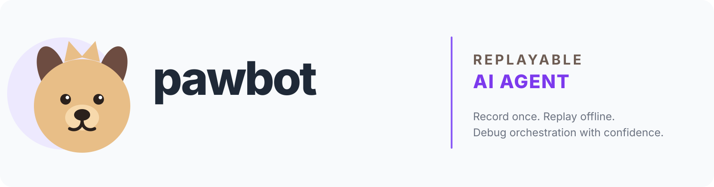
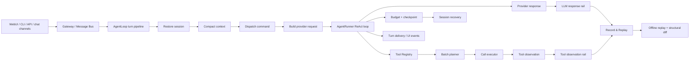

<p align="center">
  <a href="README.md">English</a> · <a href="README.zh-CN.md">简体中文</a>
</p>

<p align="center">
  <picture>
    <source media="(prefers-color-scheme: dark)" srcset="./images/readme-cover-dark.svg" />
    
  </picture>
</p>

# pawbot

### A self-hosted AI agent for your browser, terminal, and chat apps.

Give pawbot a task and it can read and write files, run commands, search the
web, call MCP tools, remember conversations, and run scheduled work. Use the
WebUI when you want a visual workspace, the terminal when you want speed, or a
chat app when you want your agent to be available wherever you are.

The feature that makes pawbot different to develop is **Record & Replay**:
record one real agent turn, then replay it offline while you change the code —
without another model request, another token bill, or real tool side effects.

## Start here

| You want to... | Start with... |
|---|---|
| Install the released package | [Quick install](#quick-install) |
| Open the browser workspace | [WebUI](#webui) |
| Run one request from a terminal | [CLI](#cli) |
| Connect a chat app | [Channels](#channels-and-integrations) |
| Understand the replay feature | [Record & Replay](#record--replay) |
| Change the agent or add a tool | [Development](#development) |

## What can pawbot do?

- Work with files, shell commands, web search, web fetching, documents, images,
  and other tools.
- Connect to MCP servers and load extensions without changing the core agent.
- Keep session history and long-term memory across conversations.
- Run long tasks and scheduled automations.
- Use Anthropic, OpenAI-compatible endpoints, local models, fallbacks, and
  model presets.
- Reach the same agent from the WebUI, CLI/TUI, API, or supported chat channels.
- Expose a Python SDK and an OpenAI-compatible API for your own applications.

## How a turn works

Every entry point reaches the same turn pipeline. The important boundary is
between the orchestration loop and the provider/tool rails: the former can be
budgeted, cancelled, checkpointed, and replayed without making the provider or
real tools part of a regression test.



The result is one execution unit with explicit resource limits, recovery
checkpoints, tool side-effect boundaries, and an offline evidence trail.

## Why pawbot?

### One agent, several ways to use it

The WebUI, terminal, API, and chat channels share the same conversations,
tools, and configuration. Start in the browser and continue from the terminal;
or keep the agent running behind a gateway and talk to it from a chat app.

### Record an agent once, replay it as often as you need

LLM calls and external tools make agent bugs expensive and difficult to repeat.
Pawbot records the model responses and tool observations of a turn. Replay then
runs the current agent code against those recorded inputs:

- no new provider request;
- no new token cost;
- no network dependency;
- no real tool side effects;
- a structural diff when orchestration changes.

This is useful for debugging, regression tests, and safe refactoring of the
agent loop.

### Keep your data on your machine

Pawbot is designed for self-hosting. Sessions, configuration, workspaces, and
recordings stay under your control. Shell commands, file access, network tools,
and MCP servers are explicit capabilities with documented security boundaries.

## Quick install

### Published package

After the package is published, install and open the WebUI with one command:

macOS / Linux:

```bash
uv tool install --force --upgrade pawbot-ai && pawbot
```

Windows PowerShell:

```powershell
uv tool install --force --upgrade pawbot-ai; pawbot
```

The repository also includes isolated fallback installers. On a fresh desktop
install they start the WebUI automatically; use `pawbot agent` when you want the
terminal/TUI client explicitly:

- [`scripts/install.sh`](scripts/install.sh)
- [`scripts/install.ps1`](scripts/install.ps1)

For a fresh macOS or Linux desktop, the installer can be run directly from
GitHub:

```bash
curl -fsSL https://raw.githubusercontent.com/m2dumpling/pawbot/v0.3.2/scripts/install.sh | sh
```

If `curl` is not available, use `wget` instead:

```bash
wget -qO- https://raw.githubusercontent.com/m2dumpling/pawbot/v0.3.2/scripts/install.sh | sh
```

For native Windows PowerShell:

```powershell
iex (irm https://raw.githubusercontent.com/m2dumpling/pawbot/v0.3.2/scripts/install.ps1)
```

The installer selects an active virtual environment, `uv`, `pipx`, or a
dedicated `~/.pawbot/venv` fallback, then opens the WebUI on a fresh desktop.
Before creating the fallback environment it verifies that Python's `venv` and
`ensurepip` support is available. If a minimal Debian/Ubuntu image is missing
`python3.x-venv`, installation stops with the exact package command to run and
does not print a misleading startup command. On success it runs
`pawbot --version`; if the launcher is not on the current shell's `PATH`, it
prints the verified launcher path and the command to use now. Configure the
first Provider and model in **Settings → Models** before sending your first
task.

### From a source checkout

Requirements: Python 3.11+ and [uv](https://docs.astral.sh/uv/). Bun is only
needed when developing the WebUI or TUI.

```bash
uv sync --all-extras --dev
uv run pawbot --help
```

Install optional channel dependencies when needed:

```bash
uv run --no-sync python -m scripts.install_channel_dependencies --all-channels
```

## Quick start

### WebUI

The browser workspace is the easiest first run:

```bash
uv run pawbot webui
```

Configure your first provider and model in **Settings → Models**, start a new
conversation, and send `Hello!`. The first-run WebUI binds to localhost by
default.

### CLI

Run `pawbot` without a subcommand to open the WebUI. Use `pawbot agent` when
you explicitly want the terminal/TUI client.

Run one request and exit:

```bash
uv run pawbot agent --message "Explain the top-level modules in this repository"
```

Start the gateway directly when you want a long-running process:

```bash
uv run pawbot gateway
```

Keep the gateway in the background:

```bash
uv run pawbot gateway --background
uv run pawbot gateway status
uv run pawbot gateway logs
```

## Record & Replay

Record a real turn:

```bash
uv run pawbot agent \
  --message "Inspect the repository and summarize the agent loop" \
  --record .pawbot/blackbox/demo
```

Replay it offline:

```bash
uv run pawbot agent --replay .pawbot/blackbox/demo
```

The concise equivalent is:

```bash
uv run pawbot replay .pawbot/blackbox/demo
```

Add `--benchmark` to print provider-free local replay timing and message/diff
counts.

In the WebUI, **Settings → Record & Replay** provides the same workflow:
click **Start recording**, run tasks across as many chat sessions as needed,
then click **Stop recording**. The recording window belongs to the agent, so
all turns before Stop are stored in one sample. Incomplete samples stay visible
with a reason and can be deleted from the UI instead of failing later on replay.

Pause after an iteration and inspect the reconstructed messages:

```bash
uv run pawbot agent \
  --replay .pawbot/blackbox/demo \
  --break-at 2
```

The recording contains the provider-response rail, the tool-observation rail,
and the turn envelope. Replay checks tool ordering, result insertion, context
governance, continuation, and the final message structure. See
[docs/record-replay.md](docs/record-replay.md) for the format and privacy
boundary.

When choosing a model in **Settings → Models**, pawbot also reads capability
metadata from the provider's `/models` response when available, then applies
curated metadata for known model IDs. Context length and supported reasoning
levels are shown before saving; if an API does not advertise them, the UI says
so and keeps the value manually editable. See the curated
[model capability registry](docs/model-capabilities.md) for the fallback table
and context-window migration rules.

## Channels and integrations

Pawbot can be used from its WebUI, terminal, OpenAI-compatible API, Python SDK,
WebSocket channel, and supported chat channels. MCP servers and extension
points let you add capabilities without hard-coding them into the agent loop.

## Architecture

```text
User message
    ↓
Channel / WebUI / CLI / API
    ↓
AgentLoop: prepare the conversation and run one turn
    ↓
AgentRunner: ask the model, call tools, add results, repeat when needed
    ↓
Provider + ToolRegistry + MCP
    ↓
Answer, saved session, and channel response
```

The core source is organized around:

- `pawbot/agent/loop.py` — turn orchestration;
- `pawbot/agent/runner.py` — the model/tool loop;
- `pawbot/agent/turn/` — turn state and stages;
- `pawbot/agent/blackbox/` — Record & Replay;
- `pawbot/agent/tools/` — tool contracts and execution;
- `pawbot/session/` — conversations, memory, and recovery;
- `pawbot/providers/` — model adapters and retries.

## Documentation

- [Documentation index](docs/README.md)
- [Record & Replay](docs/record-replay.md)
- [Release notes](docs/release-notes/0.3.2.md)
- [Publishing guide](docs/publishing.md)
- [Changelog](CHANGELOG.md)
- [Contributing](CONTRIBUTING.md)
- [Security policy](SECURITY.md)

## Security and privacy

Pawbot can run shell commands, access local files, call network tools, and
connect to MCP servers. Read [`SECURITY.md`](SECURITY.md) before enabling them.

Never commit:

- `config.json`, `.env*`, provider credentials, or certificates;
- `.pawbot/` recordings and session data;
- `work/`, `sessions/`, `run/`, SQLite files, or private logs;
- prompts, tool results, or local paths containing personal information.

Replay artifacts can contain sensitive prompts and tool output. Sanitize them
before sharing; use `tests/fixtures/blackbox/` for repository-safe examples.

## Development

```bash
uv sync --all-extras --dev
uv run --no-sync python -m scripts.install_channel_dependencies --all-channels
uv run ruff check pawbot
uv run basedpyright
uv run pytest -q
```

For WebUI changes:

```bash
cd webui
bun install --frozen-lockfile
bun run test
bun run build
```

## Project status

Pawbot is an Alpha/Experimental Preview project. It is ready for personal
self-hosting, development, testing, and small single-node deployments. It does
not currently promise multi-instance session consistency, durable distributed
execution, automatic failover, or enterprise high availability.

## License

MIT — see [LICENSE](LICENSE) and
[THIRD_PARTY_NOTICES.md](THIRD_PARTY_NOTICES.md).
