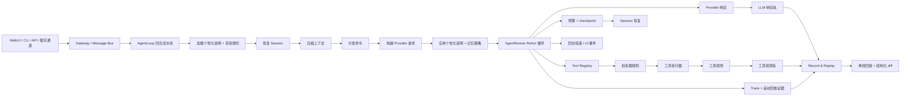

<p align="center">
  <a href="README.md">English</a> · <a href="README.zh-CN.md">简体中文</a>
</p>

<p align="center">
  <picture>
    <source media="(prefers-color-scheme: dark)" srcset="./images/readme-cover-dark.svg" />
    
  </picture>
</p>

# pawbot

### 一个可以运行在浏览器、终端和聊天应用里的自托管 AI Agent。

> **选择使用界面：** 运行 `pawbot` 打开 WebUI，运行 `pawbot agent` 打开原生
> 终端界面（TUI）。

把任务交给 pawbot，它可以读写文件、执行命令、搜索网页、调用 MCP 工具、
记住对话，并按计划执行工作。想要可视化操作就用 WebUI，想要速度就用终端，
想让 Agent 随时可用就接入聊天应用。

pawbot 最适合 Agent 开发者的能力是 **Record & Replay（录制与回放）**：
真实执行一次 Agent 回合，然后在修改代码时离线重放——不需要重新请求模型、
不产生新的 Token 消耗，也不会执行真实工具副作用。

## 从这里开始

| 你想做什么 | 从这里开始 |
|---|---|
| 安装已发布版本 | [快速安装](#快速安装) |
| 打开浏览器工作台 | [WebUI](#webui) |
| 在终端执行一次请求 | [CLI](#cli) |
| 接入聊天应用 | [通道与集成](#通道与集成) |
| 了解回放能力 | [Record & Replay](#record--replay录制与回放) |
| 验证 AI 修改后的代码 | [Agent Harness Benchmark](#agent-harness-benchmark) |
| 查看完整使用方法 | [使用指南](docs/usage.zh-CN.md) |
| 修改 Agent 或增加工具 | [开发](#开发) |

## pawbot 能做什么？

- 使用文件、Shell、网页搜索、网页抓取、文档、图片等工具；
- 连接 MCP Server，并通过扩展增加能力；
- 跨对话保存 Session History 和长期记忆；
- 在 **设置 → 个性化** 中单独填写全局个性化说明、管理记忆；使用 `/memories`
  控制当前会话是否使用或生成记忆；
- 使用 `/remember` 立即保存全局或工作区偏好，不依赖 Dream 或上下文压缩；
- 执行长期任务和定时自动化；
- 使用 Anthropic、OpenAI 兼容端点、本地模型、Fallback 和 Model Preset；
- 通过 WebUI、CLI/TUI、API 或聊天通道访问同一个 Agent；

需要长期保存偏好时，可以使用 `/remember global reply_language=zh-CN`，也可以在
WebUI 的用户消息上点击“保存为记忆”。自然语言“请记住……”会先提取为待确认候选，
Dream 自动发现的内容也不会在确认前直接生效。
- 提供 Python SDK 和 OpenAI 兼容 API，方便集成到自己的应用。

## 一次回合是怎样执行的？

所有入口最终都会进入同一套回合流水线。核心边界在于：编排循环和
Provider/工具轨道彼此分离，因此一次执行可以被预算、取消、checkpoint、
恢复和离线回放，而不需要把真实 Provider 或工具带进回归测试。



因此，一次执行不再只是一个无边界的 `while` 循环，而是一个具备资源
上限、恢复 checkpoint、工具副作用边界和离线证据链的执行单元。

### 可靠性边界

当前运行时还明确了三条边界：

- **记忆来源：** 用户确认的偏好、Dream 候选和外部 Tool/网页内容拥有不同的信任级别和来源引用；
- **个性化边界：** 用户填写的个性化说明、项目规则、已确认记忆和自动候选彼此分离，
  可以在全局或当前会话级别关闭；
- **任务断言：** `TaskContract` 支持 `must`、`must_not` 和部分 `ordered` 约束，逐条返回
  `passed`、`failed` 或 `not_evaluable`；
- **Gateway 恢复：** 协商后的 WebSocket protocol v1 提供事件序列号、缺口回放、WebUI
  mutation 幂等和 `pawbot doctor` 诊断；旧客户端仍保持兼容。

## 为什么是 pawbot？

### 一个 Agent，多种入口

WebUI、终端、API 和聊天通道共享同一套对话、工具和配置。你可以在浏览器
里开始任务，再从终端继续；也可以让 Agent 运行在 Gateway 中，直接从聊天应用
与它对话。

### 录制一次 Agent，反复离线回放

模型请求和外部工具让 Agent Bug 很难复现，也让每次测试都要付出成本。
pawbot 会保存一个回合中的模型响应和工具观测。回放时，当前 Agent 代码会
使用这些历史输入重新执行：

- 不重新请求 Provider；
- 不消耗新的 Token；
- 不依赖网络；
- 不产生真实工具副作用；
- 编排行为变化时输出结构化 diff。

这适合调试、回归测试和安全重构 Agent Loop。

### 数据留在你自己的机器上

pawbot 面向自托管。Session、配置、Workspace 和录制文件都由你自己控制。
Shell、文件访问、网络工具和 MCP Server 都是明确的能力，并有对应的安全边界。

## 快速安装

### 已发布 Python 包

包发布后，可以一条命令完成安装并打开 WebUI。

macOS / Linux：

```bash
uv tool install --force --upgrade pawbot-ai && pawbot
```

Windows PowerShell：

```powershell
uv tool install --force --upgrade pawbot-ai; pawbot
```

已有安装可以直接更新到最新版本，不会重新进入 Provider 和 API Key 配置流程：

```bash
pawbot update
```

更新命令会保留 Provider 凭证、通道配置、会话和工作区。

如果 Windows 上的 v0.4.1 安装在更新时报告 `os error 32`，请先关闭 Pawbot，
手动执行一次 `uv tool install --force --upgrade --refresh pawbot-ai`。从
v0.4.2 开始，`pawbot update` 会把升级交给辅助进程，等当前启动器释放后再
替换，因此不需要再手动处理文件锁。

仓库还提供隔离安装脚本。全新桌面环境会自动打开 WebUI；如果需要终端/TUI，
请显式运行 `pawbot agent`：

- [`scripts/install.sh`](scripts/install.sh)
- [`scripts/install.ps1`](scripts/install.ps1)

macOS/Linux 可以直接通过 GitHub 一键安装：

```bash
curl -fsSL https://raw.githubusercontent.com/m2dumpling/pawbot/v0.6.5/scripts/install.sh | sh
```

如果系统没有 `curl`，也可以使用 `wget`：

```bash
wget -qO- https://raw.githubusercontent.com/m2dumpling/pawbot/v0.6.5/scripts/install.sh | sh
```

Windows 原生 PowerShell：

```powershell
iex (irm https://raw.githubusercontent.com/m2dumpling/pawbot/v0.6.5/scripts/install.ps1)
```

安装器会按顺序选择当前虚拟环境、`uv`、`pipx` 或独立的
`~/.pawbot/venv`，全新桌面环境会自动打开 WebUI。创建独立环境前，安装器
会先检查 Python 的 `venv` 和 `ensurepip` 是否可用。如果 Debian/Ubuntu
最小镜像缺少 `python3.x-venv`，安装会立即停止并给出准确的依赖安装命令，
不会继续打印误导性的启动命令。安装成功后会执行 `pawbot --version`；如果
启动器不在当前 Shell 的 `PATH` 中，会显示已验证的启动器路径和立即运行的
命令。首次使用前，请在 **Settings → Models** 中配置 Provider。Quick Start
和 WebUI 会在输入凭证后探测兼容 Provider 的 `/models` 接口，自动选择可用
模型，并用 pawbot 的能力表补全上下文长度和思考档位。如果接口不提供模型
列表，界面仍会保留手动填写模型 ID 的入口。

### 从源码安装

要求：Python 3.11+ 和 [uv](https://docs.astral.sh/uv/)。发布包第一次执行
`pawbot agent` 时会按平台下载并校验原生 TUI；从源码开发 WebUI 或 TUI 时才
需要 Bun。

```bash
uv sync --all-extras --dev
uv run pawbot --help
```

只有需要对应聊天通道时，才安装全部可选通道依赖：

```bash
uv run --no-sync python -m scripts.install_channel_dependencies --all-channels
```

## 快速开始

### WebUI

浏览器工作台适合第一次使用：

```bash
uv run pawbot webui
```

在 **Settings → Models** 中配置 Provider，pawbot 会优先探测可用模型；创建
一个新对话并发送 `Hello!`。首次启动默认只绑定本机地址。

如果 pawbot 运行在 Linux 服务器上，`127.0.0.1` 只代表服务器本机，外部
电脑无法直接打开。需要远程访问时显式绑定所有网卡：

```bash
pawbot webui --remote --yes --no-open
```

然后在你自己的电脑浏览器打开 `http://<服务器IP>:8765`，并填写服务器配置文件中的
`channels.websocket.tokenIssueSecret`。只放行 WebUI 端口，默认 `18790` 的
Gateway health 端口必须保持内网；公网使用前应加 HTTPS/reverse proxy。更
安全的方式是使用 SSH 隧道：

```bash
ssh -N -L 8765:127.0.0.1:8765 <用户>@<服务器>
```

然后在本地打开 `http://127.0.0.1:8765`。

### CLI

直接运行 `pawbot` 会打开 WebUI；运行 `pawbot agent` 会打开原生终端界面（TUI）。
在没有图形界面的 Linux 服务器上，`pawbot` 会保持 WebUI 只监听本机，并直接
打印可复制的 SSH 隧道命令；需要从另一台电脑访问时，运行
`pawbot webui --remote --yes --no-open`。

执行一次请求并退出：

```bash
uv run pawbot agent --message "解释这个仓库的顶层模块"
```

如果要让 Gateway 常驻后台，请执行：

```bash
uv run pawbot gateway
```

让 Gateway 在后台运行：

```bash
uv run pawbot gateway --background
uv run pawbot gateway status
uv run pawbot gateway logs
```

## Record & Replay（录制与回放）

Pawbot 把三个容易混淆的用途分开：

- **实时执行记录**：每个回合自动生成，只展示阶段、耗时、状态和错误，
  不复制完整 Prompt 或工具返回值。
- **滚动回放留证**：默认在本机保留每个会话最近 20 个回合的完整回放材料。
  工具失败、模型错误、取消、预算耗尽或副作用未知的回合会自动保留为候选问题，
  不会因为没有提前点击录制而立即丢失。
- **回归样本**：用户主动保存一次完整执行，包含请求、模型响应、工具调用和
  工具返回；从开始保存到停止期间，所有会话都会写入同一份样本。
- **离线验证**：使用回归样本重走当前 Agent 编排，不请求供应商、不执行真实工具，
  用来判断代码修改后原来的执行路径是否仍然一致。

保存一次真实执行作为回归样本：

```bash
uv run pawbot agent \
  --message "检查仓库并总结 Agent Loop" \
  --record .pawbot/blackbox/demo
```

离线回放：

```bash
uv run pawbot agent --replay .pawbot/blackbox/demo
```

也可以使用简写：

```bash
uv run pawbot replay .pawbot/blackbox/demo
```

加上 `--benchmark` 可以输出不请求 Provider 的本地回放耗时，以及消息和 diff
数量。

在 WebUI 对话窗口右上角点击**轨迹图标**，可以边执行边查看当前回合：阶段、模型请求、
工具调用、耗时、限长摘要、重试、审批和错误都会按发生顺序出现。**设置 → 执行与回归**
保留跨会话的样本和离线验证工作台：点击“保存为回归样本”，可以切换或新开多个会话，
最后点击“停止保存”。保存窗口属于整个 Agent，停止前的所有回合都会写入同一份样本。
残缺样本会保留并显示原因，也可以直接在前端删除，不会等到离线验证时才报错。

网关正在运行时，也可以从 CLI 控制：

```bash
uv run pawbot record start --name demo
uv run pawbot record status
uv run pawbot record stop
uv run pawbot record list
uv run pawbot trace list --filter errors
uv run pawbot trace show <trace-id>
uv run pawbot eval list
uv run pawbot eval run --json
```

WebUI 中也可以使用同一套入口：输入 `/record candidates` 查看最近自动保留的问题回合，
用 `/record keep <candidate-id>` 把其中一个永久保存为回归样本；输入 `/eval run` 运行不请求
真实 Provider 的任务评测集。

离线验证后，展开任意回合即可看到可读的执行过程：用户请求、Provider 实际返回的模型思考
记录、模型决策、工具调用、工具返回预览和最终回答，并且按实际发生顺序排列。长参数和
返回值可以在对应事件内展开；点击“查看原始记录”则会进入全屏窗口查看完整 JSON/JSONL。
绿色结果只表示在录制输入和工具观测保持不变时没有发现可观察差异，不是模型质量评分。

在指定迭代处暂停并查看重建后的消息：

```bash
uv run pawbot agent \
  --replay .pawbot/blackbox/demo \
  --break-at 2
```

录制文件包含模型响应轨、工具观测轨和 Turn Envelope。回放会检查工具顺序、
工具结果插入、上下文治理、Continuation 和最终消息结构。分享录制文件前，
请检查其中的 Prompt、工具结果和本地路径。

### 任务验收与安全恢复

pawbot 可以检查任务是否真的达到了声明的结果，而不是把模型最后一句
“完成了”当成证明。TaskContract 可以要求最终文本、成功执行的 Tool、
Tool 返回内容、文件存在、文件内容，或调用方提供的同步校验函数：

~~~python
from pawbot import Pawbot, TaskContract

result = await bot.run(
    "创建发布说明并验证结果。",
    task_contract=TaskContract(
        id="release-note",
        final_content_contains=("verified",),
        required_tools=("write_file", "read_file"),
        required_files=("CHANGELOG.md",),
    ),
)
print(result.task_evaluation)  # passed、failed 或 not_evaluable
~~~

一次性终端运行也可以把声明式契约放进 JSON 文件，通过 --task-contract 传入：

~~~json
{
  "id": "release-note",
  "final_content_contains": ["verified"],
  "required_files": ["CHANGELOG.md"]
}
~~~

~~~bash
pawbot agent --message "创建并验证发布说明" --task-contract contract.json
~~~

验收失败时，具体未通过的条件会作为模型可见反馈交回 Agent；只要仍在正常的
回合和迭代预算内，Agent 就可以继续修正。任务验收结果会和“回放是否一致”、
“原执行是否出现工具或模型错误”分别展示。

每个 Tool 还可以声明副作用类型、幂等性、是否可撤销、恢复策略和可选执行凭证。
只读或明确声明幂等的操作可以在中断后安全重试；未知、非幂等或不可逆操作会
安全停止并要求人工确认。pawbot 不会把取消操作假装成已经自动回滚外部副作用。

### Agent Harness Benchmark

Record & Replay 检查一次保存下来的真实执行；Agent Harness 则用 9 个固定的成功、
任务和失败场景，驱动真实的 `AgentRunner` 批量验证行为。它不请求真实 Provider，也不
触碰用户 Workspace，当前覆盖正常 Tool 调用、写入后回读校验、调查后总结、Tool 失败
恢复、Provider 错误、模型超时、用户取消、回合预算边界，以及写入型 Tool 执行前的人工
确认。

AI 修改代码后可以运行：

```bash
uv run --no-sync pawbot harness run
```

同一项行为检查也包含在本地质量门禁中：

```bash
uv run --no-sync python scripts/quality_gate.py
```

Harness 已将执行轨迹检查和简单任务契约（最终内容、要求成功的 Tool）分开；更复杂的
领域评测器属于下一阶段。因此，回放或 Harness 变绿都不是通用的模型回答质量评分。

### Agent 任务评测集

任务评测集是在 Harness 之上的一层小型、确定性评测。当前包含 6 个固定任务和边界场景，
分别观察任务结果、执行轨迹和回合状态。它使用脚本化 Provider 和内存 Tool，不请求网络，
也不触碰真实 Workspace，可以直接接入 CI：

```bash
pawbot eval list
pawbot eval run --json
```

报告会分别统计 `task_passed`、`trajectory_passed`、`not_evaluable`、工具失败、模型请求次数
和耗时。这是代码和编排的回归门禁，不是通用模型准确率评分。滚动缓存中的真实失败回合，
在确认其中没有不应保留的敏感内容后，也可以提升为永久回归样本。

WebUI 使用“工作区访问”时，写入、执行和网络 Tool 会在真正运行前等待明确批准；
“完全访问”仍表示用户主动授予这些 Tool 直接执行权限。原生 TUI 使用同一套确认协议。

在 **设置 → 模型** 中选择模型时，pawbot 会优先读取提供商 `/models` 返回的能力信息，
但对于已知模型 ID，内置能力目录会覆盖提供商返回的过时或通用值；未知模型才使用
接口提供的信息，并保留手动设置入口。上下文长度和支持的思考档位会在保存前显示。
模型能力目录维护在 `pawbot/providers/registry.py`，并由 WebUI 的能力设置展示。

在 TUI 中，`/model` 会列出当前提供商探查到的模型，并显示已知的上下文长度和思考档位。
`/model <model-id>` 会把已探查或手动输入的模型固定到当前会话，`/model default` 恢复
配置中的默认模型；这个会话选择不会改写全局配置。

#### Provider 兼容性说明

当前仓库对 **DeepSeek** 这条路径做了最充分的验证：V4 模型能力表、1M 上下文元数据、
思考档位、Tool Call 历史补全、流式 Tool Call 拼接、重试/错误元数据，以及对应的本地
Provider 契约测试都放在同一条测试链路中。其他 Provider 使用统一适配层，可能可以正常
工作，但不同接口或中转站在模型列表、reasoning 字段、流式事件、Tool Call 格式、会话请求头
和错误语义上可能存在差异，不能默认拥有与 DeepSeek 相同的验证覆盖。使用其他 Provider 时，
请针对自己的 endpoint 做实际验证；如果遇到协议差异，可以补充对应的适配测试，或等待后续
版本继续优化。

自托管进程需要限制压力时，可以选择配置以下进程级护栏：
`PAWBOT_MAX_CONCURRENT_REQUESTS`、`PAWBOT_MAX_CONCURRENT_PER_SENDER`、
`PAWBOT_PROVIDER_MAX_INFLIGHT` 和 `PAWBOT_PROVIDER_RPM`。也可以使用 Provider 专属变量，
例如 `PAWBOT_DEEPSEEK_RPM`，它会覆盖通用值。这些限制只在当前进程内生效，不是分布式限流服务。

## 通道与集成

pawbot 支持 WebUI、终端、OpenAI 兼容 API、Python SDK、WebSocket 通道和聊天
通道。MCP Server 与扩展点可以在不修改 Agent Loop 的情况下增加能力。

## 架构

```text
用户消息
   ↓
通道 / WebUI / CLI / API
   ↓
AgentLoop：准备对话并运行一个回合
   ↓
AgentRunner：请求模型、调用工具、回填结果、按需继续
   ↓
Provider + ToolRegistry + MCP
   ↓
回答、保存的 Session 和通道响应
```

核心源码位于：

- `pawbot/agent/loop.py`：回合编排；
- `pawbot/agent/runner.py`：模型与工具循环；
- `pawbot/agent/turn/`：回合状态和阶段；
- `pawbot/agent/blackbox/`：Record & Replay；
- `pawbot/agent/tools/`：工具契约和执行；
- `pawbot/session/`：对话、记忆和恢复；
- `pawbot/providers/`：模型适配和重试。

## 文档

- [变更记录](CHANGELOG.md)
- [贡献指南](CONTRIBUTING.md)
- [安全策略](SECURITY.md)

## 安全与隐私

pawbot 可以执行 Shell、访问本地文件、调用网络工具和连接 MCP Server。
启用这些能力前请阅读 [`SECURITY.md`](SECURITY.md)。

以下内容不能提交到 Git：

- `config.json`、`.env*`、Provider 凭证和证书；
- `.pawbot/` 录制文件和 Session 数据；
- `work/`、`sessions/`、`run/`、SQLite 文件和私有日志；
- 包含个人信息的 Prompt、工具结果和本地路径。

回放文件可能包含敏感 Prompt 和工具输出。分享前必须脱敏；仓库示例请使用
`tests/fixtures/blackbox/` 中的安全 Fixture。

## 开发

```bash
uv sync --all-extras --dev
uv run --no-sync python -m scripts.install_channel_dependencies --all-channels
uv run ruff check pawbot
uv run basedpyright
uv run pytest -q
uv run --no-sync python scripts/quality_gate.py
```

修改 WebUI 时：

```bash
cd webui
bun install --frozen-lockfile
bun run test
bun run build
```

## 项目状态

pawbot 当前处于 Alpha/Experimental Preview 阶段，适合个人自托管、开发、
测试和小规模单节点部署。当前不承诺多实例 Session 一致性、持久化分布式执行、
自动故障接管或企业级高可用。

## 许可证

MIT — 详见 [LICENSE](LICENSE) 和
[THIRD_PARTY_NOTICES.md](THIRD_PARTY_NOTICES.md)。
