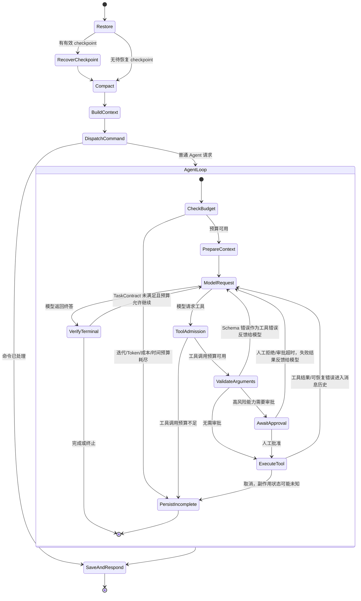

# Agent 控制流、人工介入与恢复契约

本文记录 Pawbot 当前 Agent 的实际控制流，作为排查故障和面试讲解的维护文档。核心使用有界 ReAct 循环；Turn pipeline 负责编排会话、恢复、上下文、执行与持久化。恢复 checkpoint 只能恢复本地对话状态，不能撤销已经发生的外部副作用。

## 一次 Turn

## 恢复及副作用边界

| 情况 | 处理 | 关键实现/验证 |
|---|---|---|
| 正常终答 | 返回 AgentRunResult，Turn 保存对话和 outcome | `pawbot/agent/runner.py`、`pawbot/agent/turn/stages.py` |
| 预算耗尽 | 不再发起新的模型/工具请求，记录 stop reason | `pawbot/agent/budget.py`、`pawbot/agent/runner.py` |
| 参数不合法 | 在真实工具执行前进行类型转换和 Schema 校验；错误反馈给模型，受迭代预算限制 | `pawbot/agent/tools/registry.py`、`pawbot/agent/tools/execution.py`；`tests/tools/test_tool_validation.py` |
| 写入/执行/联网能力 | ToolApprovalManager 等待授权；拒绝或超时 fail closed | `pawbot/agent/approval.py`、`pawbot/agent/tools/execution.py`；`tests/agent/test_tool_approval.py` |
| 工具执行中取消 | 记录执行可能已产生副作用，不将其误报为“回滚” | `pawbot/agent/tools/execution.py`；`tests/agent/test_tool_execution_policy.py` |
| 崩溃/网关重启 | checkpoint 将 pending 操作物化为 interruption 结果；已知安全重试可以继续，未知/非幂等写入要求再次确认 | `pawbot/session/recovery.py`、`pawbot/agent/turn/stages.py`；`tests/session/test_recovery.py`、`tests/session/test_recovery_fault_injection.py` |
| MCP 连接中断 | 连接级重连；瞬时调用失败最多按 MCP wrapper 策略重试一次；超时有独立错误结果 | `pawbot/agent/tools/mcp.py`；`tests/agent/test_mcp_transient_retry.py`、`tests/agent/test_mcp_reconnect_crash.py` |

## 执行边界

- `AgentLoop` 的阶段顺序为恢复 → session compaction → command dispatch → 上下文构建 → AgentRunner → 保存 → 响应。
- `AgentRunner` 每轮先执行预算检查和上下文治理，然后请求模型，再执行工具或验证终答。
- 参数校验发生在 approval/side effect 之前；参数错误会被作为工具消息返回模型尝试修正，失败次数由 turn 的迭代/工具调用预算约束。
- 高风险审批通过才进入执行；恢复中的操作即便操作内容看起来相同，也不会由本地 checkpoint 擅自假设外部系统没有执行。
- Read-only 或明确声明 idempotent/safe-retry 的 Tool 可按其执行策略恢复；未知、非幂等或不可逆操作必须取得人工确认，或由 Tool 自身的服务端回执确认状态。
- `ToolExecutionContext.operation_id` 给自定义 adapter 提供跨重试稳定的逻辑操作 ID；只有 adapter 和目标服务明确支持幂等键时，才能把 `idempotency_key` 发送到远端。Pawbot 不把 MCP 的任意调用都伪装成服务端幂等。
- Record & Replay 的工具结果来自录制轨道；回放不会调用真实副作用。它验证固定模型响应/观察下的当前编排回归，不验证 live model 质量。

## MCP 重试与熔断边界

当前 MCP client 为连接断开提供 session refresh；tool/resource/prompt 的瞬时调用错误最多自动重试一次，调用有独立超时。它没有跨调用的全局 circuit breaker。此阶段保留这一边界：服务端调用可能有副作用，通用熔断只会停止发送请求，并不能证明调用失败或可安全重放。若后续运行数据表明某个只读 MCP server 持续故障，再为该只读连接单独设计带冷却和半开探测的熔断；有副作用的调用仍需服务端回执/幂等契约。

## MCP SDK / 协议兼容矩阵

Pawbot 依赖 MCP Python SDK `>=2.0,<3`，本次锁定 SDK `2.2.0`。SDK v2 在 2026-07-28 规范上使用 `server/discover`；Pawbot 首先尝试现代 discovery，**只有收到 JSON-RPC method-not-found (`-32601`) 才回退到旧版 `initialize` 握手**。授权失败、协议校验失败和其他服务端错误不会被降级吞掉。

| 对端/传输 | Pawbot 行为 | 本地验证 |
|---|---|---|
| 2026-07-28 对端 | v2 `ClientSession.discover()`，按无会话协议继续 | `tests/agent/test_mcp_connection.py` 的 discovery 分支；`tests/agent/test_mcp_reconnect_crash.py` 的真实 Streamable HTTP MCP server |
| 2025 及更早对端 | 仅 method-not-found 后执行 v1-era `initialize` | `tests/agent/test_mcp_connection.py` 的 legacy fallback 分支 |
| stdio | SDK stdio transport + Pawbot 生命周期所有权/清理 | `tests/tools/test_mcp_tool.py`、`tests/agent/test_mcp_connection.py` |
| SSE / Streamable HTTP | HTTPX2 client、每请求 URL 校验、解析后 DNS 固定、环境代理 mount、有限超时 | `tests/security/test_security_network.py`、`tests/tools/test_mcp_tool.py` |
| 远端 OAuth | 使用 v2 `AuthorizationCodeResult`；原始回调 `iss` 传给 SDK 做 issuer 校验；OAuth client 使用 HTTPX2 Auth 类型 | `tests/tools/test_mcp_oauth.py`、`tests/webui/test_mcp_oauth_api.py` |

MCP v2 将 `httpx`/`httpx-sse` 改为独立的 `httpx2` 类型；把 HTTPX1 transport 或 OAuth Auth 对象交给 SDK 会导致类型错误或失去网络安全保证。因此 MCP 专用远端 client 必须使用 `PinnedDNSAsyncTransport2`，不能只替换 import 后直接交给 SDK。

## 何时考虑显式状态图

当前阶段化 Turn pipeline 和有界 ReAct loop 已能表达串行交接、预算、恢复、审批和终止路径，暂时不需要为面试换成 LangGraph。若业务出现多个持久化分支、可由用户反复恢复的长工作流、跨步骤人工审批、并行子图合并或基于业务状态的复杂循环，应评估把这些**业务工作流**显式建模为图；底层仍需保留工具安全策略、budget 和 recovery invariants。
