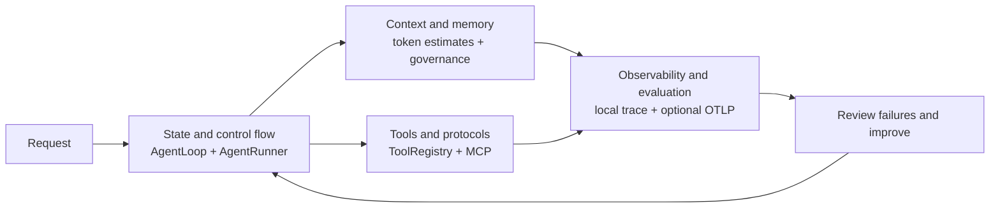
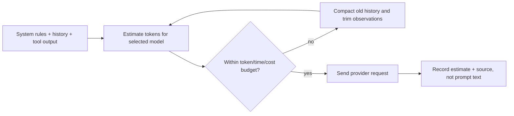

# Agent evaluation and observability

This note describes the current implementation and its limits. Pawbot keeps its bounded ReAct loop and staged turn pipeline; the project does not require LangGraph to expose state transitions, budgets, checkpoints, or approval boundaries.

## Four engineering dimensions



| Dimension | Current Pawbot implementation | Evidence |
|---|---|---|
| State and control flow | Staged `AgentLoop`, bounded `AgentRunner`, budgets, persisted checkpoints, recovery, and approval callbacks | [`agent-control-flow.md`](agent-control-flow.md), `tests/session/test_recovery*.py`, `tests/agent/test_tool_approval.py` |
| Context and memory | Model-family token estimation with an explicit fallback source, context budgeting/compaction, tool-result limits, and persistent memory | `pawbot/agent/token_estimation.py`, `pawbot/agent/context_governance.py`, `tests/agent/test_memory_context_eval.py` |
| Tools and protocols | JSON Schema validation, repair feedback through the agent loop, MCP SDK v2, timeout/reconnect policy, approval, execution policy, and optional idempotency context | `pawbot/agent/tools/registry.py`, `pawbot/agent/tools/mcp.py`, `pawbot/agent/tools/execution.py` |
| Observability and evaluation | Local JSONL trace and Record & Replay, deterministic CI harness/eval, an opt-in real-provider task eval, and optional OTLP export | `pawbot/agent/observability.py`, `pawbot/agent/live_eval.py`, `pawbot/agent/otel.py` |

Unknown tokenizer mappings remain estimates; a provider's private billing tokenizer can differ. Compaction tests prove preservation rules, but they do not prove semantic summaries are always faithful. Checkpoints restore local execution state and cannot roll back a remote side effect.

The context path estimates the model-specific input size before a request, applies the turn budget, compacts older history while preserving recent legal tool-call/result pairs, and bounds large tool observations. The trace records the estimate and its source without exporting prompt text:



## Evaluation layers

### Deterministic pull-request gate

```bash
uv run --no-sync pawbot harness run
uv run --no-sync pawbot eval run --json
uv run --no-sync python scripts/quality_gate.py
```

The Harness exercises the real `AgentRunner` with scripted provider responses and in-memory tools. The fixed Task Eval set checks six framework behaviors. These commands make no model requests and do not use the user's workspace. They are suitable for every pull request, but they are not live model-quality measurements.

### Live incident-triage evaluation

The current suite is version 3 and contains 20 public synthetic deployment incidents encoded as schema-v1 EvalCases. It is a focused operations-triage scenario, not a claim that Pawbot's model quality has already been measured on production incidents. Cases cover provider recovery, MCP compatibility, context governance, approvals, tool repair, retries, and safety boundaries. Two general questions check that the agent can avoid unnecessary tools.

List and run cases:

```bash
uv run --no-sync pawbot eval live list
uv run --no-sync pawbot eval live run \
  --case incident-429-recovered \
  --trials 3 \
  --seed 42 \
  --max-total-cost-usd 1.00 \
  --label baseline \
  --output eval-reports/baseline.json
```

Configure input/output token prices in agent defaults, or pass `--input-cost-per-million` and `--output-cost-per-million`. The live command requires an explicit spend cap. Cost is estimated from provider usage and configured prices; the cap is checked between model operations, so the final in-flight request can finish above the remaining amount. Use a conservative cap and small case selection when first connecting a provider.

Every trial constructs a fresh provider, `AgentRunner`, fake read APIs, tool registry, temporary workspace, and trace. The runner does not access the user's checkout or a real deployment API. `--seed` reproducibly shuffles case order; `--temperature`, configured model preset, and `--trials` are recorded in the report. Providers do not share a universal request-seed parameter, so the seed is not represented as model-level deterministic sampling.

Deterministic graders report outcome, required tool/argument calls, forbidden tools, partial-order constraints, and answer/safety checks separately. They allow alternatives where the case defines them. `--judge` adds a second call to the same configured provider for cases with a subjective rubric; it is a supplemental signal, can return `unknown`, and is not an independent or human-calibrated judge.

Compare two reports using the same case catalog:

```bash
uv run --no-sync pawbot eval live run --trials 3 --seed 42 \
  --max-total-cost-usd 1.00 --label candidate --output eval-reports/candidate.json
uv run --no-sync pawbot eval live compare \
  --baseline eval-reports/baseline.json \
  --candidate eval-reports/candidate.json
```

Reports contain case and trial status, failures, tool calls, token counts, configured-price cost estimates, latency percentiles, model/prompt/catalog versions, and JSONL trace paths. They report `pass_at_1`, `pass_at_k` (at least one pass among the requested trials), and the stricter `all_trials_pass_rate`; non-evaluable provider/runner failures do not count as passes.

### Reviewing rolling failures

The existing rolling blackbox candidate queue still supports rejection and promotion to a replay sample. Live evaluation export is a separate explicit action: a reviewer supplies a new sanitized case payload, a non-private source, and a local review reference. The resulting standalone versioned catalog includes only that reviewed payload; it never copies recorded prompts, responses, or tool results. Add the catalog to a live run with `--catalog <path>`. Private cases are refused before a provider request.

```bash
pawbot record export-live-eval candidate-123 \
  --case-json reviewed-case.json \
  --review-reference issue-456
pawbot eval live run --catalog <printed-catalog-path> --max-total-cost-usd 1.00
```

## Trace and OTLP lifecycle

The local TraceStore and WebUI trace view continue to work offline. OTLP export is disabled unless both `observability.otelEnabled` is true and an OTLP endpoint environment variable is set. For example:

```json
{
  "observability": {
    "otelEnabled": true,
    "otelServiceName": "pawbot",
    "otelSampleRatio": 0.25
  }
}
```

```powershell
$env:OTEL_EXPORTER_OTLP_ENDPOINT = "http://localhost:4318"
pawbot gateway
```

Install the optional SDK/exporter with `uv sync --extra otel`. Pawbot translates its existing trace events into a root turn span, model-request/retry and tool spans, approval spans, and bounded lifecycle events for checkpoint/recovery/verification. GenAI spans use attributes such as `gen_ai.operation.name`, `gen_ai.provider.name`, `gen_ai.request.model`, and token usage. Metrics use low-cardinality outcome/provider/direction labels; session and user identifiers are not metric labels.

The OTel bridge never exports prompts, model answers, tool arguments, tool results, channel IDs, session IDs, or user IDs. Only W3C `traceparent`/`tracestate` are propagated from the channel boundary into the agent turn; baggage is not propagated. OTLP transport/export uses the standard OpenTelemetry Python exporter pipeline and GenAI semantic-convention attribute names ([GenAI spans](https://github.com/open-telemetry/semantic-conventions-genai/blob/main/docs/gen-ai/gen-ai-spans.md), [Python exporters](https://opentelemetry.io/docs/languages/python/exporters/)).

## Local, deterministic report

For a no-network demonstration, run the fixed suite and save its JSON output:

```powershell
New-Item -ItemType Directory -Force eval-reports | Out-Null
pawbot eval run --json | Set-Content -Encoding utf8 eval-reports/deterministic-task-eval.json
```

This is a provider-free framework regression report, not a live model baseline. A live baseline/candidate pair requires a configured provider, explicit token prices, and a user-selected spend cap.

## Known limits

- The built-in live catalog is synthetic and hand-authored. It needs sanitized failures from real Pawbot deployments and human calibration before being used as a product-quality claim.
- The local fake APIs verify tool selection and arguments, but they do not test network behavior or compatibility with a production MCP server.
- The optional judge uses the same provider/model as generation in this first version. Compare it with human labels or a separately configured judge before using it as a release threshold.
- Cost is an estimate and cannot stop an already in-flight provider response.
- OTLP export is optional; the application does not provision a collector, backend, alert rules, or dashboard.
