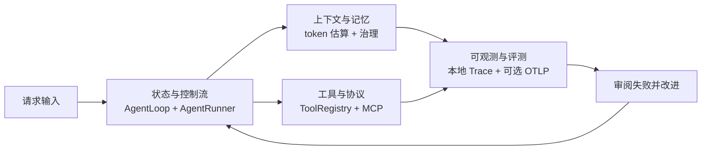
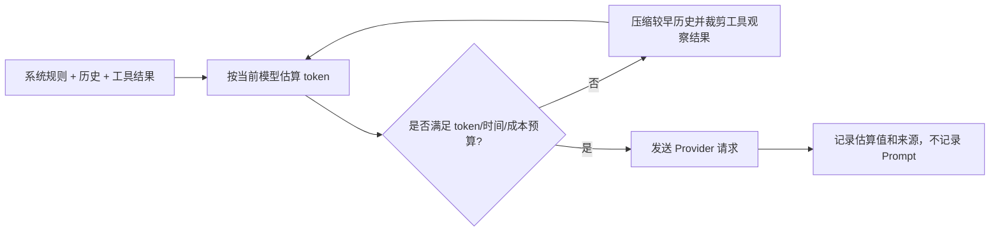

# Agent 评测与可观测性

本文说明当前实现和已知边界。Pawbot 保留自研的有界 ReAct 循环和分阶段 Turn pipeline；状态流转、预算、checkpoint 和审批边界不依赖 LangGraph 才能表达。

## 四个工程维度



| 维度 | Pawbot 当前实现 | 证据 |
|---|---|---|
| 状态与控制流 | 分阶段 `AgentLoop`、有界 `AgentRunner`、预算、持久化 checkpoint、恢复和审批回调 | [`agent-control-flow.md`](agent-control-flow.md)、`tests/session/test_recovery*.py`、`tests/agent/test_tool_approval.py` |
| 上下文与记忆 | 模型族 token 估算并报告回退来源、上下文预算/压缩、工具结果限额和持久记忆 | `pawbot/agent/token_estimation.py`、`pawbot/agent/context_governance.py`、`tests/agent/test_memory_context_eval.py` |
| 工具与协议 | JSON Schema 校验、通过 Agent loop 反馈错误并修正、MCP SDK v2、超时/重连策略、审批、执行策略和可选幂等上下文 | `pawbot/agent/tools/registry.py`、`pawbot/agent/tools/mcp.py`、`pawbot/agent/tools/execution.py` |
| 可观测与评测 | 本地 JSONL Trace 与 Record & Replay、确定性 CI Harness/Eval、可选真实 Provider 任务评测和 OTLP 导出 | `pawbot/agent/observability.py`、`pawbot/agent/live_eval.py`、`pawbot/agent/otel.py` |

未知模型的 tokenizer 结果仍是估算；Provider 的私有计费 tokenizer 可能不同。压缩测试证明了保留规则，却不能证明每次语义摘要都忠实。Checkpoint 恢复的是本地执行状态，无法撤销远端副作用。

上下文路径会在请求前估算当前模型的输入 token，执行回合预算，压缩较早历史并保留最近合法的工具调用/结果对，同时限制大工具观察结果。Trace 记录估算值和来源，不导出 Prompt 原文：



## 评测分层

### 每个 Pull Request 运行的确定性门禁

```bash
uv run --no-sync pawbot harness run
uv run --no-sync pawbot eval run --json
uv run --no-sync python scripts/quality_gate.py
```

Harness 使用脚本 Provider 响应和内存 Tool 驱动真实 `AgentRunner`。固定 Task Eval 检查六个框架行为。这些命令不请求模型、不访问用户 Workspace，适合每个 Pull Request 运行，但不是 live 模型质量测量。

### 真实模型的事件分诊评测

当前评测集为 v3，包含 20 个公开合成的部署事件，单例仍使用 schema-v1 EvalCase 格式。它是一个聚焦运维分诊的场景，不能宣称 Pawbot 已在生产事件上验证了模型质量。用例覆盖 Provider 恢复、MCP 兼容性、上下文治理、审批、工具参数修正、重试和安全边界；其中两个通用问题专门检查 Agent 是否会避免不必要的工具调用。

查看并运行：

```bash
uv run --no-sync pawbot eval live list
uv run --no-sync pawbot eval live run \
  --case incident-429-recovered \
  --trials 3 \
  --seed 42 \
  --max-total-cost-usd 1.00 \
  --label baseline \
  --output eval-reports/baseline.json
```

在 agent defaults 中配置输入/输出 token 单价，或传入 `--input-cost-per-million` 和 `--output-cost-per-million`。Live 命令要求显式设置成本上限。成本按 Provider 用量和配置单价估算；上限在模型操作之间检查，最后一个已经发起的请求可能在剩余额度之外完成。首次接入 Provider 时建议使用保守上限和少量用例。

每个 trial 都新建 Provider、`AgentRunner`、假只读 API、Tool Registry、临时 Workspace 和 Trace。Runner 不访问用户 checkout 或真实部署 API。`--seed` 可复现地打乱 case 顺序；`--temperature`、配置的模型 preset 和 `--trials` 会写入报告。各 Provider 没有统一的请求级随机种子参数，因此这里的 seed 不会伪装成模型采样的确定性保证。

确定性 grader 会分别报告结果、必需的工具/参数调用、禁止调用的工具、偏序约束以及回答/安全检查。用例定义了多条合法表达时，grader 会接受对应备选词。`--judge` 会对带主观 rubric 的用例向同一 Provider 额外发起一次请求；它只是辅助信号，可以返回 `unknown`，当前还不是独立或经过人工校准的 Judge。

使用相同数据集比较报告：

```bash
uv run --no-sync pawbot eval live run --trials 3 --seed 42 \
  --max-total-cost-usd 1.00 --label candidate --output eval-reports/candidate.json
uv run --no-sync pawbot eval live compare \
  --baseline eval-reports/baseline.json \
  --candidate eval-reports/candidate.json
```

报告包含每个 case/trial 的状态、失败原因、工具调用、token 数、按配置单价计算的成本估值、延迟分位数、模型/提示词/数据集版本和 JSONL Trace 路径。报告分别给出 `pass_at_1`、`pass_at_k`（指定重复次数中至少成功一次）和更严格的 `all_trials_pass_rate`；Provider/Runner 错误会记为不可评测，不能算通过。

### 审阅滚动失败样例

现有 rolling blackbox 候选队列仍支持拒绝候选并提升为 Replay 样本。Live Eval 导出是单独的显式操作：审阅者提供去敏任务、fixture、oracle、非私密来源和本地审阅引用。导出的版本化 catalog 只包含审阅后的 payload，不会复制录制中的 Prompt、Response 或 Tool Result。使用 `--catalog <path>` 运行该 catalog。私密 case 会在发起 Provider 请求前被拒绝。

```bash
pawbot record export-live-eval candidate-123 \
  --case-json reviewed-case.json \
  --review-reference issue-456
pawbot eval live run --catalog <打印出的 catalog 路径> --max-total-cost-usd 1.00
```

## Trace 与 OTLP 生命周期

本地 TraceStore 和 WebUI Trace 仍可离线使用。只有 `observability.otelEnabled` 为 `true` 且设置了 OTLP endpoint 环境变量时，才会启用 OTLP 导出。例如：

```json
{
  "observability": {
    "otelEnabled": true,
    "otelServiceName": "pawbot",
    "otelSampleRatio": 0.25
  }
}
```

```powershell
$env:OTEL_EXPORTER_OTLP_ENDPOINT = "http://localhost:4318"
pawbot gateway
```

使用 `uv sync --extra otel` 安装可选 SDK/exporter。Pawbot 将现有 Trace 事件转换为 Turn 根 Span、模型请求/重试与 Tool Span、审批 Span，以及 checkpoint/恢复/验收等有界生命周期事件。GenAI Span 使用 `gen_ai.operation.name`、`gen_ai.provider.name`、`gen_ai.request.model` 和 token 用量等属性。Metrics 使用低基数的结果/Provider/方向标签；Session ID 和用户 ID 不作为 Metric 标签。

OTel bridge 不导出 Prompt、模型回答、工具参数、工具结果、channel/chat ID、Session ID 或用户 ID。它只从 Channel 边界向 Agent Turn 传播 W3C `traceparent`/`tracestate`，不传播 baggage。OTLP 使用标准 OpenTelemetry Python exporter pipeline 和 GenAI 语义约定属性名：[GenAI spans](https://github.com/open-telemetry/semantic-conventions-genai/blob/main/docs/gen-ai/gen-ai-spans.md)、[Python exporters](https://opentelemetry.io/docs/languages/python/exporters/)。

## 可复现的本地报告

运行固定的无网络套件并保存 JSON 输出：

```powershell
New-Item -ItemType Directory -Force eval-reports | Out-Null
pawbot eval run --json | Set-Content -Encoding utf8 eval-reports/deterministic-task-eval.json
```

这是 Provider-free 的框架回归报告，不是 live 模型基线。真实的 baseline/candidate 需要配置 Provider、token 单价和用户指定的成本上限。

## 已知限制

- 内置 live 用例是合成并由人工编写的。将它作为产品质量结论前，还需要来自真实 Pawbot 部署的去敏失败样例和人工校准。
- 本地假 API 可验证工具选择和参数，但不覆盖网络行为或生产 MCP Server 兼容性。
- 第一版可选 Judge 与生成使用同一个 Provider/model。设置发布门禁前，应使用人工标签或单独配置的 Judge 进行比较。
- 成本只是估算，不能中止已经开始的 Provider 请求。
- OTLP 导出是可选的；项目不会替用户部署 Collector、后端、告警规则或 Dashboard。
