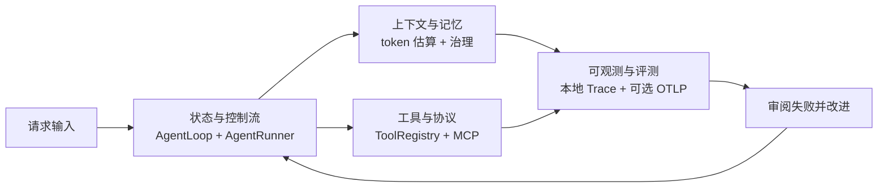
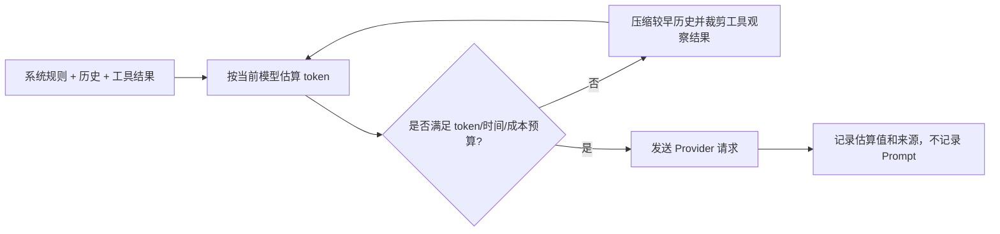

# Agent 评测与可观测性

本文说明当前实现和已知边界。Pawbot 保留自研的有界 ReAct 循环和分阶段 Turn pipeline；状态流转、预算、checkpoint 和审批边界不依赖 LangGraph 才能表达。

真实模型回归的主入口已经收敛到 [`evals/promptfoo`](../evals/promptfoo)：Promptfoo 负责用例编排、重复运行和报告，Pawbot 负责隔离 Fixture、确定性评分和 Trace。旧自研评测入口已移除，使用方法以[Promptfoo 评测说明](agent-evaluation-promptfoo.zh-CN.md)为准。

## 四个工程维度


```mermaid
flowchart LR
    Request[请求输入] --> State[状态与控制流\nAgentLoop + AgentRunner]
    State --> Context[上下文与记忆\ntoken 估算 + 治理]
    State --> Tools[工具与协议\nToolRegistry + MCP]
    Context --> Eval[可观测与评测\n本地 Trace + 可选 OTLP]
    Tools --> Eval
    Eval --> Change[审阅失败并改进]
    Change --> State
```

| 维度 | Pawbot 当前实现 | 证据 |
|---|---|---|
| 状态与控制流 | 分阶段 `AgentLoop`、有界 `AgentRunner`、预算、持久化 checkpoint、恢复和审批回调 | [`agent-control-flow.md`](agent-control-flow.md)、`tests/session/test_recovery*.py`、`tests/agent/test_tool_approval.py` |
| 上下文与记忆 | 模型族 token 估算并报告回退来源、上下文预算/压缩、工具结果限额和持久记忆 | `pawbot/agent/token_estimation.py`、`pawbot/agent/context_governance.py`、`tests/agent/test_memory_context_eval.py` |
| 工具与协议 | JSON Schema 校验、通过 Agent loop 反馈错误并修正、MCP SDK v2、超时/重连策略、审批、执行策略和可选幂等上下文 | `pawbot/agent/tools/registry.py`、`pawbot/agent/tools/mcp.py`、`pawbot/agent/tools/execution.py` |
| 可观测与评测 | 本地 JSONL Trace 与 Record & Replay、确定性 CI Harness/Eval、可选真实 Provider 任务评测和 OTLP 导出 | `pawbot/agent/observability.py`、`evals/promptfoo/provider.py`、`pawbot/agent/otel.py` |

未知模型的 tokenizer 结果仍是估算；Provider 的私有计费 tokenizer 可能不同。压缩测试证明了保留规则，却不能证明每次语义摘要都忠实。Checkpoint 恢复的是本地执行状态，无法撤销远端副作用。

上下文路径会在请求前估算当前模型的输入 token，执行回合预算，压缩较早历史并保留最近合法的工具调用/结果对，同时限制大工具观察结果。Trace 记录估算值和来源，不导出 Prompt 原文：


```mermaid
flowchart LR
    History[系统规则 + 历史 + 工具结果] --> Count[按当前模型估算 token]
    Count --> Budget{是否满足 token/时间/成本预算?}
    Budget -->|否| Compact[压缩较早历史并裁剪工具观察结果]
    Compact --> Count
    Budget -->|是| Request[发送 Provider 请求]
    Request --> Trace[记录估算值和来源，不记录 Prompt]
```

## 评测分层

### 每个 Pull Request 运行的确定性门禁

```bash
uv run --no-sync pawbot harness run
uv run --no-sync pawbot eval run --json
uv run --no-sync python scripts/quality_gate.py
```

Harness 使用脚本 Provider 响应和内存 Tool 驱动真实 `AgentRunner`。固定 Task Eval 检查六个框架行为。这些命令不请求模型、不访问用户 Workspace，适合每个 Pull Request 运行，但不是 live 模型质量测量。

### Promptfoo 真实模型诊断评测

入口为 [`evals/promptfoo`](../evals/promptfoo/README.md)：固定 npm 版本、10 个用例、
本地工具 Fixture、公共确定性断言、重复 Trial、可选软 LLM Judge 与 JSON/HTML 报告。
Python Provider 直接驱动真实 AgentRunner，每次重置环境，正确结果不进入模型请求。
它不执行真实 shell 或部署工具。

该套件测量诊断决策、工具取证和诚实表达，不能替代 Runtime Harness 或真实集成测试。
Provider/API 执行错误单独记录，不混成质量断言失败。没有单价时成本保持未知。
报告比较、原始 Transcript 阅读和三次 Trial 的解释边界见[完整说明](../evals/promptfoo/README.md)。

### 审阅滚动失败证据

滚动候选仍可保留为永久 Replay 样本或忽略。保留失败轨迹不等于批准了任务验收标准。
新增 Promptfoo Case 时先阅读 Trace、确认责任归属，再脱敏最小场景、固定 Fixture、
明确期望结果并人工核对后回归。旧工作台 API、Live CLI/catalog 和专用导出已移除；
已有本地录制和历史报告不删除，也不自动迁为正式用例。

## Trace 与 OTLP 生命周期

本地 TraceStore 和 WebUI Trace 仍可离线使用。只有 `observability.otelEnabled` 为 `true` 且设置了 OTLP endpoint 环境变量时，才会启用 OTLP 导出。例如：

```json
{
  "observability": {
    "otelEnabled": true,
    "otelServiceName": "pawbot",
    "otelSampleRatio": 0.25
  }
}
```

```powershell
$env:OTEL_EXPORTER_OTLP_ENDPOINT = "http://localhost:4318"
pawbot gateway
```

使用 `uv sync --extra otel` 安装可选 SDK/exporter。Pawbot 将现有 Trace 事件转换为 Turn 根 Span、模型请求/重试与 Tool Span、审批 Span，以及 checkpoint/恢复/验收等有界生命周期事件。GenAI Span 使用 `gen_ai.operation.name`、`gen_ai.provider.name`、`gen_ai.request.model` 和 token 用量等属性。Metrics 使用低基数的结果/Provider/方向标签；Session ID 和用户 ID 不作为 Metric 标签。

OTel bridge 不导出 Prompt、模型回答、工具参数、工具结果、channel/chat ID、Session ID 或用户 ID。它只从 Channel 边界向 Agent Turn 传播 W3C `traceparent`/`tracestate`，不传播 baggage。OTLP 使用标准 OpenTelemetry Python exporter pipeline 和 GenAI 语义约定属性名：[GenAI spans](https://github.com/open-telemetry/semantic-conventions-genai/blob/main/docs/gen-ai/gen-ai-spans.md)、[Python exporters](https://opentelemetry.io/docs/languages/python/exporters/)。

## 可复现的本地报告

运行固定的无网络套件并保存 JSON 输出：

```powershell
New-Item -ItemType Directory -Force eval-reports | Out-Null
pawbot eval run --json | Set-Content -Encoding utf8 eval-reports/deterministic-task-eval.json
```

这是 Provider-free 的框架回归报告，不是 live 模型基线。真实的 baseline/candidate 需要可用 Provider 和一致的用例/评分标准；成本单价与每 Trial 软上限为可选配置。

## 已知限制

- Promptfoo 用例是诊断场景重建和合成对照；它们展示了从失败模式提取 Task 的方法，但仍需要来自真实 Pawbot 部署的经审阅样例、独立 holdout 和人工校准，才能支持产品质量结论。
- 本地假 API 可验证工具选择和参数，但不覆盖网络行为或生产 MCP Server 兼容性。
- 可选 Judge 默认同 Provider/model，也可指定独立 preset，尚未人工校准。设置发布门禁前，应使用人工标签或单独配置的 Judge 进行比较。
- 成本只是估算，不能中止已经开始的 Provider 请求。
- OTLP 导出是可选的；项目不会替用户部署 Collector、后端、告警规则或 Dashboard。
